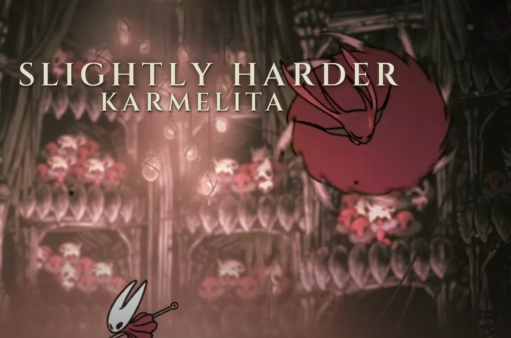

# Slightly Harder Karmelita 



A BepInEx plugin for **Hollow Knight: Silksong (mobile port)** that overhauls the
 Karmelita fight with configurable animation speed, projectile
variations, telegraph tints, and a scripted **secret** phase at low HP.

Everything is driven by a plain-text config — no code edits, no asset packs.

---

## Table of contents

- [What it does](#what-it-does)
- [Install](#install)
- [Where the config lives](#where-the-config-lives)
- [Feature reference](#feature-reference)
  - [Animation speed](#animation-speed)
  - [Behaviour tweaks](#behaviour-tweaks)
  - [Projectile variations](#projectile-variations)
  - [Phase pools](#phase-pools)
  - [Telegraph tints](#telegraph-tints)
  - [Scream](#scream)
  - [The Last Stand](#the-last-stand)
- [Tuning recipes](#tuning-recipes)
- [Troubleshooting](#troubleshooting)
- [Building from source](#building-from-source)
- [Credits / license](#credits--license)

---

## What it does

| System | Description |
|--------|-------------|
| **Animation speed** | Per-state multiplier (antic, attack, recoil, movement). Vanilla P3 speed is preserved by default. |
| **Behavior** | Block / Force Evade are rewired to Attack Choice. Contact damage can be disabled. |
| **Projectile variations** | Nine different shot patterns replace her vanilla sickle throws. The active pattern is chosen at random per throw from a per-phase pool, and shown to the player as a sprite tint. |
| **Telegraph tints** | Colour-coded per variation (Fan5 = white, Boomerang = lime, etc.) so the player can react to what's coming. |

The whole mod is off unless `[General] Enabled = true`.

---

## Install

1. Make sure **BepInEx 5** is installed for your Silksong build.
2. Drop `KarmelitaTweaksFinalvX.Y.Z.dll` into:
   ```
   BepInEx/plugins/
   ```
3. Launch the game once. A config file appears at
   `BepInEx/config/com.btw.tribetower.karmelita.cfg`.
4. Edit it, then restart the game.

Default settings are the **tuned defaults** — the fight is significantly harder
than vanilla but fair, with a wide parry window.
---

## Where the config lives

| Platform | Path |
|----------|------|
| Android | `/storage/emulated/0/Android/data/<pkg>/files/BepInEx/config/com.btw.tribetower.karmelita.cfg` |


Delete the file to reset to defaults. It's regenerated on next launch.

---

## Feature reference

### Animation speed

The `[AnimationSpeed]` section controls per-state multipliers. Each entry is a
float: `1.0` = vanilla, `1.25` = 25 % faster, `0.5` = half speed.

| Key | Default | Affects |
|-----|---------|---------|
| `RecoilSpeed` | 1.8 | Slash End, Cyclone Recoil, Spin Recoil |
| `RoarAnticSpeed` | 1.4 | P2/P3 Roar Antic and Roar |
| `AnticSpeed` | 1.4 | Every "Antic" telegraph state |
| `AttackSpeed` | 1.25 | Slash, Cyclone, Spin, Air, Wall Dive, throw states |
| `MovementSpeed` | 1.4 | Movement 1-5, Dash, Evade, Jump Back, Approach |
| `P3VanillaSpeed` | true | If true, **all** Phase 3 states play at vanilla speed |
| `P3SpeedMultiplier` | 1.0 | Extra multiplier in P3 (only if `P3VanillaSpeed = false`) |
| `MinMultiplier` | 0.5 | Hard lower clamp |
| `MaxMultiplier` | 3.0 | Hard upper clamp |

> **Do not set values outside `[MinMultiplier, MaxMultiplier]`** — that's the
> safety net that keeps the animation and the FSM's wait timers in sync. Going
> too far makes her attack anim play fast but the state ends at the vanilla
> time, which reads as "she attacked but nothing happened".

### Behaviour tweaks

Under `[Behavior]`:

- `DisableBlock` (true) — rewires `Block` state to `Attack Choice`.
- `DisableForceEvade` (true) — same for `Force Evade`.
- `RemoveContactDamage` (true) — disables the root `DamageHero` so touching her
  doesn't damage you.
- `SkipTransitionPatchesInP3` (true) — safety: disables Wall Dive Loop and
  Feint transition patches once Phase 3 begins, protecting the Last Stand.

### Projectile variations

Under `[Projectiles]`:

| Key | Default | Notes |
|-----|---------|-------|
| `Enabled` | true | Master toggle |
| `ProjectileSpeed` | 28 | Velocity for regular throws |
| `AirSicklesBothSides` | true | Mirror Air Sickles |
| `ThrowL_Angles` | `205,192,180,167` | Left throw fan |
| `ThrowR_Angles` | `-25,-12,0,12` | Right throw fan |
| `AirSickles_Angles` | `-30,-10,10` | Air Sickles fan |
| `ProjectileLifetime` | 3.0 | Auto-destroy delay (seconds) |
| `MaxSpawnsPer2s` | 100 | Safety cap on live projectiles |
| `ForceDamage` | 2 | Overrides sickle damage. `-1` = leave untouched |

Available variation names (used in `[Phases]` pools):

```
fan5, stagger4, aimed, radial, boomerang, p3combo, delayedwall, airfan, skyrain
```

### Phase pools

Under `[Phases]` — each phase rolls a variation from a CSV list:

```ini
P1Variations = fan5,stagger4,radial
P2Variations = radial,stagger4,skyrain,delayedwall
P3Variations = boomerang,p3combo,skyrain,delayedwall
```

The roll happens **once per throw** and survives brief state detours within
`Telegraph.DoubleThrowWindow` seconds. Boomerang is excluded from being rolled
twice in a row (it's considered "unfair" to chain).

### Telegraph tints

Under `[Telegraph]` and `[Telegraph.Colors]`. Whenever a variation is rolled,
her sprite is tinted with the matching colour. `TintStrength = 0` disables the
effect visually without disabling the mechanic.

```ini
[Telegraph.Colors]
Fan5        = 1.00,1.00,1.00   # white
Stagger4    = 1.00,1.00,0.00   # yellow
Aimed       = 0.00,1.00,1.00   # cyan
Radial      = 1.00,0.40,0.00   # orange
Boomerang   = 0.00,1.00,0.00   # lime
P3Combo     = 1.00,0.00,1.00   # magenta
DelayedWall = 1.00,0.10,0.10   # red
AirFan      = 0.50,0.00,0.80   # violet
SkyRain     = 0.35,0.70,1.00   # blue
```

Format is `R,G,B` in `0.0–1.0`.

### The Last Stand

The signature feature. Under `[LastStand]`:

| Key | Default | Meaning |
|-----|---------|---------|
| `Enabled` | true | Turn the feature on/off |
| `HpThreshold` | 500 | HP at which the trigger is armed |
| `TriggerDelay` | 0.65 | Seconds after threshold before it fires (lets P3 roar play out) |
| `Duration` | 10 | How long the phase lasts |
| `CornerOffsetXLeftWall` | 7 | X offset used when she triggers **left** of the player (positive = toward player) |
| `CornerOffsetXRightWall` | -7 | X offset used when she triggers **right** of the player (negative = toward player) |
| `CornerOffsetY` | 2 | Y offset from her trigger Y |
| `ProjectilePattern` | `3,4,3,4,3,4,3,4,3` | Comma-separated burst sizes |
| `BurstDelay` | 1.0 | Seconds between bursts |
| `ProjectileSpeed` | 20 | Speed of Last Stand projectiles |
| `BurstSpread` | 35 | Total angular spread in degrees |
| `HoldStates` | `Throw L,Throw R` | FSM states cycled for the throw animation |
| `ExitState` | `Wall Dive` | State forced after the phase ends |

**How it works:**

1. HP is polled every frame via reflection on `HealthManager`.
2. Once HP ≤ `HpThreshold`, a `TriggerDelay` timer starts.
3. When the timer fires:
   - Any active FSM transition patch is cleared.
   - She is teleported to `triggerPosition + (CornerOffsetX{direction}, CornerOffsetY)`.
     The left/right offset is chosen automatically based on which side of the
     player she was on — this prevents her from being pushed into a wall.
   - Position and velocity are locked every frame.
   - The FSM is nudged into a throw state, cycling every 0.4 s.
4. `ProjectilePattern` cycles, one burst every `BurstDelay` seconds. Each
   burst fans `N` sickles over `BurstSpread` degrees, centred on the player.
5. After `Duration`:
   - She's dropped back to her pre-Last-Stand Y (so she doesn't stay floating).
   - Velocity is zeroed.
   - `ExitState` (Wall Dive) is forced.
6. A 3-second watchdog force-releases the phase if the coroutine dies for any
   reason.

**Tuning tips**

- Her teleport destination feels wrong → tweak `CornerOffsetXLeftWall` /
  `CornerOffsetXRightWall` in ±1 steps. They're directional: one applies when
  she triggers on the left side of the player, the other on the right.
- Parry window too tight → raise `BurstSpread` to 45–60.
- Parry window too generous → lower to 25–30.
- Pattern too easy → `ProjectilePattern = 4,4,4,4,4,4,4,4` (all 4s).
- Pattern too hard → `ProjectilePattern = 3` (single 3-shot stream).

---

## Tuning recipes

### "I want it exactly like the shipped defaults"
Delete the config. It'll regenerate with the tuned values.

### "I want a harder fight"
```ini
[AnimationSpeed]
AnticSpeed = 1.6
AttackSpeed = 1.4
MovementSpeed = 1.6

[LastStand]
ProjectilePattern = 4,4,4,4,4,4,4,4
BurstSpread = 25
```

### "I want a fairer fight"
```ini
[AnimationSpeed]
AnticSpeed = 1.2
AttackSpeed = 1.1
MovementSpeed = 1.2

[Projectiles]
ForceDamage = 1

[LastStand]
BurstSpread = 50
BurstDelay = 1.3
```

### "I want a completely passive Last Stand"
```ini
[LastStand]
Enabled = false
```

---

## Troubleshooting

**She gets stuck in the corner / doesn't move after Last Stand.**
Check `BepInEx/LogOutput.log` for `Last Stand cleanup (finally).` or
`Last Stand watchdog fired`. If you see either, the coroutine exited through
an error path — send the log lines around it. Otherwise, `ExitState` might not
exist in your build; try `ExitState = Attack Choice` (a hub state).

**Animations feel slow after a Sky Rain.**
Make sure `[Scream] Enabled = false` if you never want the slowdown. If you do
want it, `SlowdownMultiplier` only applies to states matching
`[Telegraph] ThrowSequenceSubstrings`. If a state you consider "throw" isn't
slowing, add its name to that list.

**She attacks but no projectiles spawn.**
Set `[General] LogDiagnostics = true` for one fight. Look for
`Spawn cap reached; skipping projectile.` — if present, raise
`[Projectiles] MaxSpawnsPer2s` to `200`.

**`ForceDamage` doesn't change projectile damage.**
The field name in your build may differ. With `LogDiagnostics = true`, watch
for `[Karmelita] HealthManager resolved` — if that also fails, your
`Assembly-CSharp.dll` uses different member names. Send me the log.

**Last Stand fires at the wrong time.**
`HpThreshold` compares against the actual `HealthManager.hp` value. Some
builds use `Health` (capital H) or `currentHealth` — the plugin tries several
names. If it never fires, look for `[Karmelita] HealthManager resolved` in the
log. If that line is missing, HP reading failed and the trigger never arms.

**The game crashes on scene load.**
Restore the config to defaults and check `LogOutput.log` for stack traces
mentioning `KarmelitaTweaks`. Include the trace when reporting.

---

## Building from source

Requires the .NET SDK, plus these DLLs placed in `libs/` next to the `.csproj`:

```
libs/
├── BepInEx.dll                    # from BepInEx/core/
├── 0Harmony.dll                   # from BepInEx/core/
├── PlayMaker.dll                  # from <game>_Data/Managed/
├── UnityEngine.dll                # from <game>_Data/Managed/
├── UnityEngine.CoreModule.dll     # from <game>_Data/Managed/
├── UnityEngine.AudioModule.dll    # from <game>_Data/Managed/
└── Assembly-CSharp.dll            # from <game>_Data/Managed/
```

Then:

```bash
dotnet build -c Release
```

Output: `bin/Release/KarmelitaTweaksFinalvX.Y.Z.dll`. Drop it into
`BepInEx/plugins/`.

The project targets `net472` so the DLL loads under the Mono runtime used by
the mobile port. On Linux you may need:

```xml
<PackageReference Include="Microsoft.NETFramework.ReferenceAssemblies" Version="1.0.3" PrivateAssets="all" />
```

---
